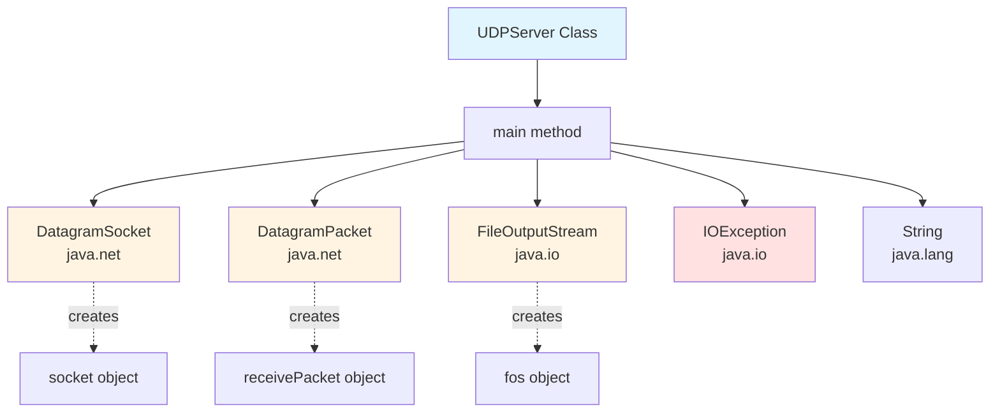
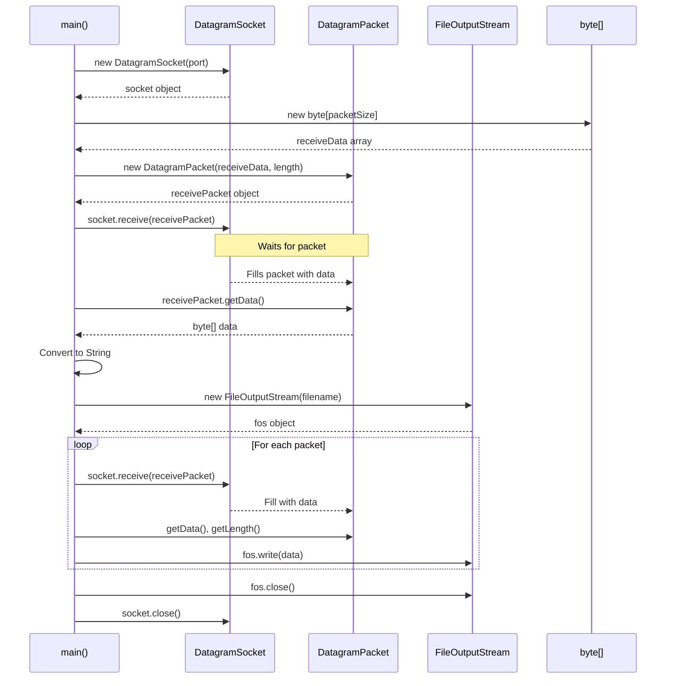
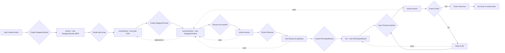
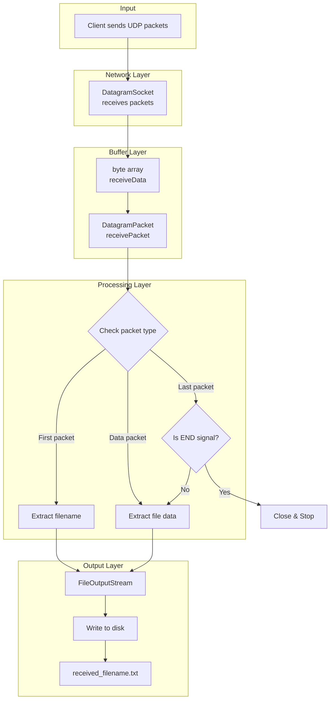
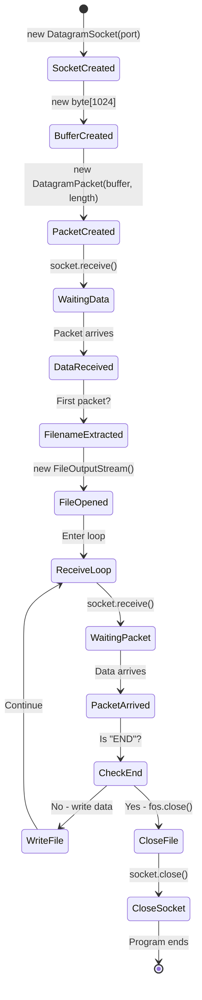
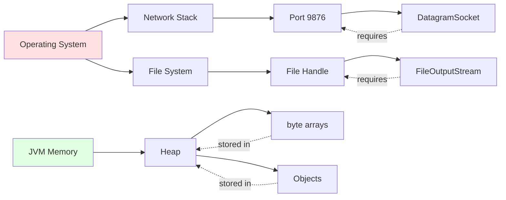

# UDPServer - Complete Architecture & Dependencies

## 📊 Class Dependency Graph



## 🔗 Object Interdependency Flow



## 📦 Complete Class & Package Hierarchy

```
java.lang (Implicit - no import needed)
├── Object (root of all classes)
│   ├── String
│   ├── System
│   └── ... all classes inherit from Object

java.io
├── OutputStream (abstract)
│   └── FileOutputStream
├── IOException
└── Closeable (interface)
    └── FileOutputStream implements this

java.net
├── DatagramSocket
│   ├── implements Closeable
│   └── Methods: receive(), send(), close(), etc.
└── DatagramPacket
    ├── Methods: getData(), getLength(), setData()
    └── Represents UDP packet
```

## 🎯 Object Creation & Dependency Chain



## 🔍 Method Call Hierarchy

```mermaid
graph TD
    A[main] --> B[DatagramSocket constructor]
    A --> C[new byte array]
    A --> D[DatagramPacket constructor]
    A --> E[socket.receive]
    A --> F[receivePacket.getData]
    A --> G[receivePacket.getLength]
    A --> H[String constructor]
    A --> I[String.trim]
    A --> J[FileOutputStream constructor]
    A --> K[String.equals]
    A --> L[fos.write]
    A --> M[fos.close]
    A --> N[socket.close]
    A --> O[System.out.println]
    A --> P[System.out.print]
    
    style A fill:#e1f5ff
    style B fill:#fff4e1
    style D fill:#fff4e1
    style E fill:#ffe1f5
    style J fill:#e1ffe1
```



## 📋 Complete Object Inventory

| Variable Name | Type | Package | Purpose | Dependencies |
|--------------|------|---------|---------|--------------|
| `port` | `int` | java.lang | Port number (9876) | None |
| `packetSize` | `int` | java.lang | Buffer size (1024) | None |
| `socket` | `DatagramSocket` | java.net | UDP socket for communication | port |
| `receiveData` | `byte[]` | java.lang | Buffer for incoming data | packetSize |
| `receivePacket` | `DatagramPacket` | java.net | Packet wrapper for data | receiveData |
| `filename` | `String` | java.lang | Name of file being received | receivePacket |
| `fos` | `FileOutputStream` | java.io | Writes data to file | filename |
| `message` | `String` | java.lang | Temporary string for checking "END" | receivePacket |
| `e` | `IOException` | java.io | Exception handler | N/A |

## 🎨 Data Flow Diagram



## 🔄 Method Execution Order

```
1. main() starts
   ├── 2. new DatagramSocket(port)
   │      └── Opens UDP socket on port 9876
   │
   ├── 3. new byte[packetSize]
   │      └── Creates 1024-byte buffer
   │
   ├── 4. new DatagramPacket(receiveData, length)
   │      └── Wraps buffer in packet structure
   │
   ├── 5. socket.receive(receivePacket)  [BLOCKS]
   │      └── Waits for first packet
   │
   ├── 6. receivePacket.getData()
   │      ├── 7. receivePacket.getLength()
   │      └── 8. new String(data, offset, length)
   │             └── 9. trim()
   │
   ├── 10. new FileOutputStream(filename)
   │       └── Creates/opens file for writing
   │
   ├── 11. LOOP: while(true)
   │       ├── 12. new byte[packetSize]  [fresh buffer]
   │       ├── 13. new DatagramPacket(receiveData, length)
   │       ├── 14. socket.receive(receivePacket)  [BLOCKS]
   │       ├── 15. new String(data, offset, length)
   │       ├── 16. message.equals("END")
   │       │      ├── TRUE → break (go to 21)
   │       │      └── FALSE → continue
   │       ├── 17. fos.write(data, offset, length)
   │       └── 18. System.out.print(".")
   │           └── Loop back to 12
   │
   ├── 21. fos.close()
   ├── 22. socket.close()
   └── 23. System.out.println(messages)
```

## 🧩 Class Method Usage Matrix

| Class | Method Used | Called By | Returns | Purpose |
|-------|-------------|-----------|---------|---------|
| **DatagramSocket** | `DatagramSocket(int port)` | main | DatagramSocket | Constructor - creates socket |
| | `receive(DatagramPacket)` | main | void | Receives incoming packet |
| | `close()` | main | void | Closes socket |
| **DatagramPacket** | `DatagramPacket(byte[], int)` | main | DatagramPacket | Constructor - wraps buffer |
| | `getData()` | main | byte[] | Gets packet data |
| | `getLength()` | main | int | Gets actual data length |
| **FileOutputStream** | `FileOutputStream(String)` | main | FileOutputStream | Constructor - opens file |
| | `write(byte[], int, int)` | main | void | Writes bytes to file |
| | `close()` | main | void | Closes file stream |
| **String** | `String(byte[], int, int)` | main | String | Constructor - bytes to string |
| | `trim()` | main | String | Removes whitespace |
| | `equals(String)` | main | boolean | Compares strings |
| **System.out** | `println(String)` | main | void | Print with newline |
| | `print(String)` | main | void | Print without newline |

## 🏗️ Object Lifecycle Diagram



## 🔐 Resource Dependencies



## 📊 Memory Allocation Map

```
STACK MEMORY (Local Variables):
├── port (int, 4 bytes)
├── packetSize (int, 4 bytes)
├── socket (reference, 8 bytes) ────┐
├── receiveData (reference, 8 bytes)─┼─┐
├── receivePacket (reference, 8 bytes)┼┼┐
├── filename (reference, 8 bytes)────┼┼┼┐
├── fos (reference, 8 bytes)─────────┼┼┼┼┐
└── message (reference, 8 bytes)─────┼┼┼┼┼┐
                                     │││││││
HEAP MEMORY (Objects):               │││││││
├── DatagramSocket object ←──────────┘││││││
├── byte[1024] array ←─────────────────┘│││││
├── DatagramPacket object ←─────────────┘││││
├── String object (filename) ←───────────┘│││
├── FileOutputStream object ←─────────────┘││
└── String object (message) ←──────────────┘│
                                            │
DISK (File System):                         │
└── received_[filename].txt ←───────────────┘
```

## 🎓 Key Takeaways

### 1. **Class Dependencies**
- UDPServer depends on 3 main classes from Java libraries
- No custom classes created (simple, single-file program)
- All dependencies are standard Java library classes

### 2. **Object Relationships**
- `DatagramSocket` → manages network communication
- `DatagramPacket` → wraps data in UDP packet format
- `FileOutputStream` → handles file writing
- All three are independent but work together

### 3. **Method Calls**
- Most methods are called directly from `main()`
- Linear execution flow with one loop
- Two blocking calls: `socket.receive()` (waits for data)

### 4. **Resource Management**
- Three resources must be closed: socket, file stream, (byte arrays auto-managed)
- Closing happens in `finally` would be best practice
- Current code closes in try block (works if no exceptions)

### 5. **Data Transformation Chain**
```
Network → byte[] → DatagramPacket → byte[] → String (for END check)
                                   → byte[] → File (for data)
```

## 🚀 Complete Dependency Summary

**External Dependencies:**
- `java.net.DatagramSocket` - UDP socket
- `java.net.DatagramPacket` - Packet wrapper
- `java.io.FileOutputStream` - File writing
- `java.io.IOException` - Error handling
- `java.lang.String` - Text processing

**Internal Dependencies:**
- `socket` depends on: port number
- `receivePacket` depends on: receiveData array
- `fos` depends on: filename string
- Loop depends on: "END" signal detection

**No Circular Dependencies:** Clean, linear flow ✅
